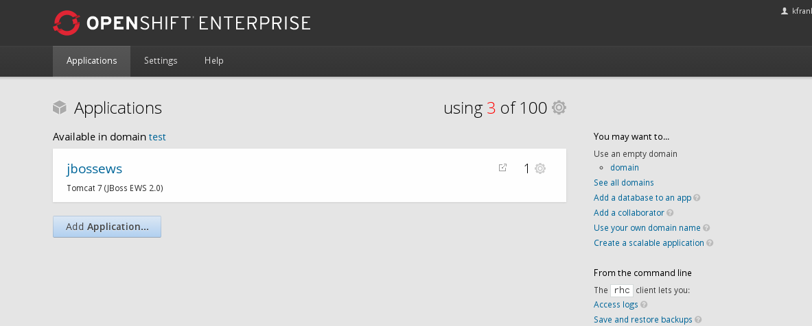
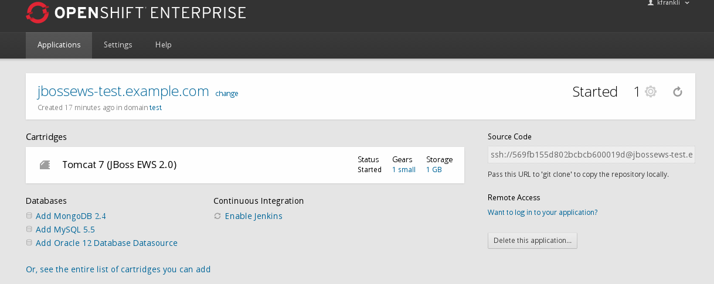
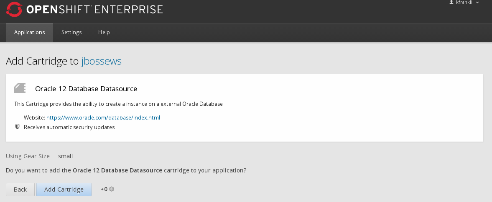
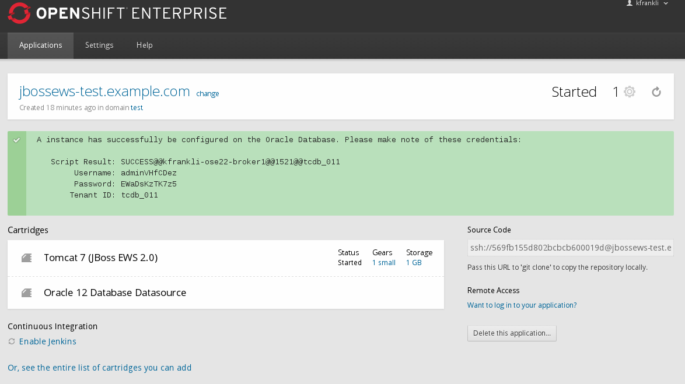

= {subject}: PREPARED FOR - {customer}
:subject: Oracle Cartridge User Guide
:description: Oracle OpenShift 2 Cartridge User Guide
:doctype: book
:confidentiality: Confidential
:customer:  FRIT
:listing-caption: Listing
:toc:
:toclevels: 6
:sectnums:
:chapter-label:
:icons: font
ifdef::backend-pdf[]
:pdf-page-size: A4
:title-page-background-image: image:../usr/doc/header.jpeg[pdfwidth=8.0in,align=center]
:pygments-style: tango
//:source-highlighter: pygments
:source-highlighter: coderay
endif::[]

== Synopsis

The purpose of this document is to present how OpenShift 2 users can interact with the Oracle OpenShift Enterprise V2.2 add-on cartridge.

The end result of their OpenShift 2 Oracle gear provisioning would be a series of environment variables being set that will allow a JDBC datasource to connect to the newly provisioned remote Oracle Database Tenant.

== OpenShift 2 Oracle Add-On Gear Creation

There are two ways to create a gear in OpenShift 2:

1. Via the OpenShift Client Tools
2. Via the OpenShift Console

=== Creating a Application with the OpenShift Red Hat Client Tools

Creating an instance of this Oracle Configuration Cartridge follows a similar processes as any other Add-On cartridge. Simply add the *"-t frb-oracle-12.0"* cartridge after the normal call to create a application. Below is an example in which a WebSphere based application is created with the Oracle Configuration Add-On Cartridge.

```
rhc app create -a myapp  -n mynamespace -t frb-websphere-8.5 -t frb-oracle-12.0
Application Options
-------------------
Domain:     mynamespace
Cartridges: frb-websphere-8.5, frb-oracle-12.0
Gear Size:  default
Scaling:    no

Creating application 'testkjf01' ... done

  A instance has successfully be configured on the Oracle Database. Please make note of these credentials:

   Script Result: SUCCESS@@oraclesrvr001@@1521@@tcdb_001
        Username: adminin5LXMY
        Password: 5XHV5JB2XteQ
       Tenant ID: tcdb_001
```

=== Adding a Add-On Cartridge via the OpenShift Web Console

The steps to create a Oracle Add-On gear to a pre-existing application via the OpenShift console are very straightforward:

[NOTE]
====================================================================
*This step assumes that the user has already created a namespace, a application has already been created, and has setup their public key in his OpenShift account.*
====================================================================

==== Select on Application

Select the pre-existing application.

[[img-console-applications]]


==== Select Oracle Add On Cartridge

In the application page, select the *"Add Oracle 12 Database Datasource"* database add-on cartridge.

[[img-console-application-details]]


==== Add Oracle Add-On Cartridge

Confirm the selection to add the *"Add Oracle 12 Database Datasource"* database add-on cartridge.

[[img-console-oracle]]


==== Oracle Add-On Cartridge Confirmation

The page will then display that OpenShift is working to add the cartridge, in several minutes you should be redirected to the next page. This page will display the connection details returned by the remotely called oracle provisioning script.

[[img-console-oracle-confirmation]]


== Using the Provisioned Oracle Database

Once the Oracle Gear completes installation, the gear sets a series of environment variables that can then be used by the web gears to connect to the newly provisioned Oracle tenant instance.

```
OPENSHIFT_ORACLE_DB_REMOTE_HOST
OPENSHIFT_ORACLE_DB_REMOTE_PORT
OPENSHIFT_ORACLE_DB_USERNAME
OPENSHIFT_ORACLE_DB_PASSWORD
OPENSHIFT_ORACLE_DB_TENANT_ID
```
