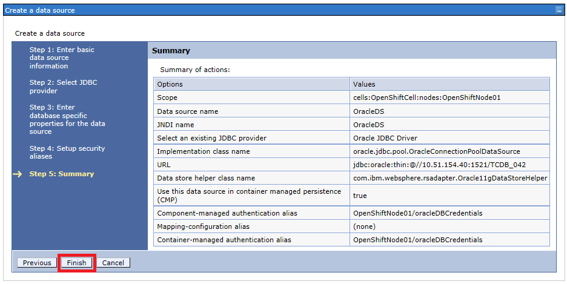

= {subject}: PREPARED FOR - {customer}
:subject: Oracle Cartridge WAS Datasource Configuration Guide
:description: Oracle OpenShift 2 Cartridge WAS Datasource Configuration
:doctype: book
:confidentiality: Confidential
:customer:  FRIT
:listing-caption: Listing
:toc:
:toclevels: 6
:sectnums:
:chapter-label:
:icons: font
ifdef::backend-pdf[]
:pdf-page-size: A4
:title-page-background-image: image:../usr/doc/header.jpeg[pdfwidth=8.0in,align=center]
:pygments-style: tango
//:source-highlighter: pygments
:source-highlighter: coderay
endif::[]

== Synopsis

The purpose of this document is to present the guidance to configure a Oracle Datasource in the IBM WebSphere® Application Server cartridge to connect to the newly provisioned Oracle DB Tenant via the Oracle Cartridge.

This is extensively based off of the IBM Knowledge Center Article: "Configuring the WebSphere Application Server data source"

== Procedure
It is first assumed that the application with the WAS cartridge and Oracle add-on cartridge has already been created.

=== Upload Driver File
For WebSphere to make use of the Oracle datasource, the Oracle JDBC driver Java Jar file must be first uploaded to the WAS Gear. First, acquire the correct JDBC driver from either the Oracle website or your Database administration team, then upload it to the gear to the *'$OPENSHIFT_DATA_DIR/profile/'* directory. The following below is a example run from the "git bash" terminal:
```
$ scp ojdbc6.jar 56a238594c9e6f5085000382@wastest02-test.example.com:/var/lib/openshift/56a238594c9e6f5085000382/app-root/data/profile/
ojdbc6.jar                                    100% 3606KB   3.5MB/s   00:00
```

<<<
=== Environment Variables
SSH to your application using RHC tools:
```
$ rhc ssh -a wastest02
Connecting to 56a22db54c9e6fb13e0003c4@wastest02-test.example.com ...
The authenticity of host 'wastest02-test.example.com (10.11.12.13)' can't be
established.
RSA key fingerprint is 54:38:52:fd:53:2d:f5:da:34:c2:3b:c1:f4:8d:be:94.
Are you sure you want to continue connecting (yes/no)? yes
Warning: Permanently added 'wastest02-test.example.com' (RSA) to the list of
known hosts.
WARNING! If you are not authorized to use this private network,
please disconnect immediately. Unauthorized access is prohibited
and will result in civil and/or criminal prosecution. Users expressly
consent to having their activities monitored.

    *********************************************************************

    You are accessing a service that is for use only by authorized users.
    If you do not have authorization, discontinue use at once.
    Any use of the services is subject to the applicable terms of the
    agreement which can be found at:
    https://www.openshift.com/legal

    *********************************************************************

    Welcome to OpenShift shell

    This shell will assist you in managing OpenShift applications.

    !!! IMPORTANT !!! IMPORTANT !!! IMPORTANT !!!
    Shell access is quite powerful and it is possible for you to
    accidentally damage your application.  Proceed with care!
    If worse comes to worst, destroy your application with "rhc app delete"
    and recreate it
    !!! IMPORTANT !!! IMPORTANT !!! IMPORTANT !!!

    Type "help" for more info.
```

<<<
Once you have logged in, runn the following command in the SSH session to retrieve the values of the Openshift application variables that are set by the Oracle Gear on creation with the values needed to connect to the Oracle database. Make sure to save this output, as it will be needed in later steps.
```
[wastest02-test.example.com 56a238594c9e6f5085000382]\> env | grep "OPENSHIFT_ORACLE_DB_"
OPENSHIFT_ORACLE_DB_HOST=127.0.0.1
OPENSHIFT_ORACLE_DB_REMOTE_HOST=testose200
OPENSHIFT_ORACLE_DB_SCRIPT_LOC=/u02/app/oracle/frit/bin/frit_dba_cdb.pl
OPENSHIFT_ORACLE_DB_USERNAME=adminTTbeCpx
OPENSHIFT_ORACLE_DB_SSH_IDENTITY_PRIVATE=/usr/libexec/openshift/cartridges/ose2-
oracle-frb-cart/id_rsa
OPENSHIFT_ORACLE_DB_SSH_IDENTITY_PUBLIC=/usr/libexec/openshift/cartridges/ose2-o
racle-frb-cart/id_rsa.pub
OPENSHIFT_ORACLE_DB_TENANT_ID=TCDB_042
OPENSHIFT_ORACLE_DB_SCRIPT_DELIMINATOR=@@
OPENSHIFT_ORACLE_DB_PORT=3306
OPENSHIFT_ORACLE_DB_SCRIPT_HOST_SERVICE_ACCOUNT=oseoradb
OPENSHIFT_ORACLE_DB_SCRIPT_HOST=127.51.154.41
OPENSHIFT_ORACLE_DB_SCRIPT_USER=oracle
OPENSHIFT_ORACLE_DB_REMOTE_PORT=1521
OPENSHIFT_ORACLE_DB_PASSWORD=DPlsZNB5p8J4
```

<<<
=== Access WebSphere Console
Using RHC tools, enable port forwarding for your application, so that the WAS administration console can be reached:
```
$ rhc port-forward -a wastest02
Checking available ports ... done
Forwarding ports ...

To connect to a service running on OpenShift, use the Local address

Service Local               OpenShift
------- -------------- ---- -----------------
java    127.0.0.1:2809  =>  127.68.114.1:2809
java    127.0.0.1:8880  =>  127.68.114.1:8880
java    127.0.0.1:9043  =>  127.68.114.1:9043
java    127.0.0.1:9060  =>  127.68.114.1:9060
java    127.0.0.1:9080  =>  127.68.114.1:9080
java    127.0.0.1:9100  =>  127.68.114.1:9100
java    127.0.0.1:9443  =>  127.68.114.1:9443
java    127.0.0.1:9633  =>  127.68.114.1:9633
oracle  127.0.0.1:3306  =>  127.68.114.2:3306

Press CTRL-C to terminate port forwarding
```
Now, using your web browser of choice, proceed to the WAS login console. You will be prompted to provide your credentials to login, which be default are your LDAP credentials.
[[img-login]]


<<<
=== Configuring Oracle Security
Once you have logged in to the WAS console, using the left hand navigation menu go to *"Security" -> "Global Security"*
[[img-security-menu]]


Next select the *"Java Authentication and Authorization Service" - > "J2C authentication data"*
[[img-java-security]]


<<<
Click *"New"*
[[img-j2c-auth]]


Enter the Alias for the credentials, in this example "oracleDBCredentials", the Oracle User ID, and Password. The User ID and Password are found from the *"$OPENSHIFT_ORACLE_DB_USERNAME"* and *"$OPENSHIFT_ORACLE_DB_PASSWORD"* respectively found earlier. Then click *"Ok"*
[[img-j2c-creds]]
image::../usr/doc/WAS_J2C_Creds.png[scaledwidth="75%", caption="Figure 5: ", title="WAS Database Credentials"]

<<<
=== Configuring Oracle JDBC Driver
Using the left hand navigation menu go to *"Resources" -> "JDBC" -> "JDBC Providers"*
[[img-driver-menu]]


In the Scope section, choose the Node level from the drop-down list, and click *"New"*
[[img-new-driver]]


<<<
On the first page of the driver wizard select the following options from the drop downs. Lastly hit *"Next"*

* Database Type: *"Oracle"*
* Provider Type: *"Oracle JDBC Driver"*
* Implementation type: *"Connection pool data source"*

[[img-jdbc-step-1]]


On the next page, add the following variable to the text field highlighted *"${USER_INSTALL_ROOT}"*, then hit *"Next"*

[[img-jdbc-step-2]]


<<<
Confirm the selections on the summary page, and then if correct hit *"Finish"*
[[img-jdbc-step-3]]


Click *"Save"* to save your selections.
[[img-jdbc-save]]


<<<
=== Configuring Data-source
Using the left hand navigation menu go to *"Resources" -> "JDBC" -> "Data sources"*
[[img-datasource-menu]]


In the Scope section, choose the Node level from the drop-down list, and hit *"New"*
[[img-datasource-new]]


<<<
Enter in the name for the Datasource, and the desired JNDI name, then hit *"Next"*
[[img-datasource-step-1]]


Select the radio button for *"Select an existing JDBC provider"*, select the provider you configured in the prior steps, and then hit *"Next"*
[[img-datasource-step-2]]


In the next step input the connection string. Using the environment varaibles found earlier it should be of the format *"jdbc:oracle:thin:@//${OPENSHIFT_ORACLE_DB_REMOTE_HOST}:${OPENSHIFT_ORACLE_DB_REMOTE_PORT}/${OPENSHIFT_ORACLE_DB_TENANT_ID}"*, you should enter in the values for the variables as has been done in the example "jdbc:oracle:thin:@//testose200:1521/TCDB_042", and then hit *"Next"*
[[img-datasource-step-3]]


<<<
Now select the authentication method set up previously from the drop downs for *"Component-managed authentication alias"* and *"Container-managed authentication alias"*, then hit *"Next"*
[[img-datasource-step-4]]


Confirm the selections on the summary page, and then if correct hit *"Finish"*
[[img-datasource-step-5]]


Click *"Save"* to save your selections.
[[img-datasource-save]]


<<<
=== Testing Data-source

Now select the checkbox next to the newly created datasource and click the *"Test connection"* button. The results of the test should be returned prompted. If it failed, recheck your steps.
[[img-datasource-test]]


== Reference Information

* https://github.com/rhtconsulting/ose2-was-frb-cart[OpenShift WAS Cartridge]
* https://github.com/rhtconsulting/ose2-oracle-frb-cart[OpenShift Oracle Cartridge]
* https://www-01.ibm.com/support/knowledgecenter/SSEQTP_7.0.0/com.ibm.websphere.nd.doc/info/ae/ae/twim_fedmap_datasconf.html[IBM Knowledge Center Article]
